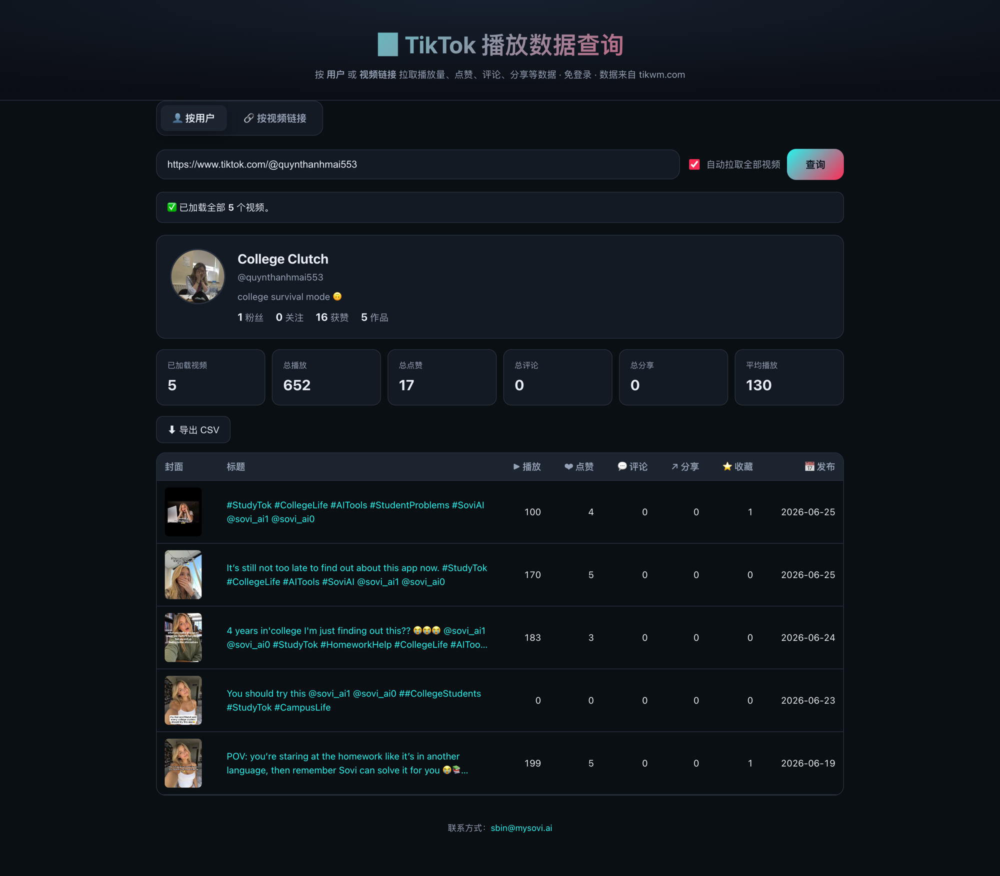

# pull-tiktok-api-free

> 免登录的 TikTok 播放数据查询工具 —— 按**用户**或**视频链接**拉取播放量、点赞、评论、分享、收藏等数据。前端 + Cloudflare Worker 后端，一键部署。

数据来源：[tikwm.com](https://www.tikwm.com) 公共 API（无需 API Key），也可通过 [Apify TikTok Scraper](https://apify.com/clockworks/tiktok-scraper) 拉取账号视频列表。



---

## ✨ 功能

- **按用户查询**：输入用户名（如 `tiktok`）或主页链接，自动拉取该用户**全部视频**，并展示每个视频的播放数据。
  - 显示作者资料（头像、昵称、粉丝数、获赞数、作品数）。
  - 聚合统计：已加载视频数、总播放 / 总点赞 / 总评论 / 总分享、平均播放。
  - 视频列表支持按任意指标排序，并可**一键导出 CSV**（含 UTF-8 BOM，Excel 中文不乱码）。
  - 游标分页，自动翻页直到拉完（可关闭自动、手动「加载更多」）。
- **按视频链接查询**：粘贴单个视频链接，展示封面、作者、标题、各项播放数据及无水印视频 / 背景音乐下载链接。
- **免登录**：纯公开访问，无需注册或鉴权。

> 设计要点：tikwm 的「用户作品」接口（`/user/posts`）的返回结果中**每个视频已经包含了播放数据**，因此「拉用户全部视频 → 再拉每个视频播放信息」只需翻页该接口即可完成，无需对每条视频单独发请求，从而避免 N+1 调用打满上游频率限制。

---

## 🏗️ 架构

```
浏览器 (public/)  ──fetch──▶  Cloudflare Worker (src/index.js)  ──fetch──▶  tikwm.com / Apify
   静态前端                      /api/* 代理 + 边缘缓存 + 校验            公共数据接口
```

- **前端**：原生 HTML / CSS / JS（无构建步骤），通过 Cloudflare [Workers Static Assets](https://developers.cloudflare.com/workers/static-assets/) 托管。
- **后端**：单个 Worker，将浏览器请求代理到 tikwm 或 Apify，集中处理：
  - **输入校验**：用户名格式、TikTok 链接合法性。
  - **边缘缓存**（Cache API）：视频 5 分钟、用户资料 10 分钟、作品列表 3 分钟 —— 因为所有访问者共用 Worker 出口 IP，缓存是抵御上游频率限制和控制 Apify 成本的主要手段。
  - **错误归一化**：把 tikwm 的 `code != 0`、HTTP 429 等转换为统一的 `{ ok:false, error, message }` 结构。
  - 通过 `[assets]` 绑定回退静态资源。

### 代理接口

| Worker 路由 | 数据源 | 说明 |
|---|---|---|
| `GET /api/video?url=<视频链接>` | tikwm `/api/?url=...&hd=1` | 单个视频 + 播放数据 |
| `GET /api/user?unique_id=<用户名>` | tikwm `/api/user/info?unique_id=...` | 用户资料 + 聚合统计 |
| `GET /api/posts?unique_id=<用户名>&cursor=&count=` | Apify 或 tikwm `/api/user/posts?...` | 用户视频列表（含每条视频播放数据） |

### Apify 数据源

配置 `APIFY_TOKEN` 后，`/api/posts` 会优先使用 Apify 的 `clockworks/tiktok-scraper` 拉取账号视频列表，并把返回字段转换成前端已有的数据结构。`/api/user` 和 `/api/video` 仍使用 tikwm。

本地开发可创建 `.dev.vars`：

```bash
APIFY_TOKEN=apify_api_xxx
TIKTOK_DATA_SOURCE=apify
```

部署到 Cloudflare Workers：

```bash
npx wrangler secret put APIFY_TOKEN
npx wrangler deploy
```

可选配置：

- `TIKTOK_DATA_SOURCE=apify`：强制 `/api/posts` 使用 Apify。
- `TIKTOK_DATA_SOURCE=tikwm`：强制继续使用 tikwm。
- `TIKTOK_DATA_SOURCE=auto`：有 `APIFY_TOKEN` 时使用 Apify，否则使用 tikwm。
- `APIFY_PROXY_COUNTRY_CODE=US`：指定 Apify Actor 的代理国家；默认 `None`。

---

## 📁 目录结构

```
pull-tiktok-api-free/
├── wrangler.toml        # Worker 配置（Static Assets + account_id）
├── package.json         # dev / deploy 脚本
├── src/
│   └── index.js         # Worker：/api/* 代理、校验、缓存、错误处理
└── public/              # 静态前端（由 Assets 运行时托管）
    ├── index.html
    ├── styles.css
    └── app.js
```

---

## 🚀 本地开发

需要 Node.js ≥ 18。

```bash
npm install            # 安装 wrangler
npm run dev            # 本地启动，默认 http://localhost:8787
```

打开浏览器访问 `http://localhost:8787`，页面会实时拉取代码中固定账号的视频数据。

---

## ☁️ 部署到 Cloudflare Workers

`wrangler.toml` 中已配置目标账号（`account_id`）。首次需登录：

```bash
npx wrangler login     # 浏览器 OAuth 登录（若尚未登录）
npm run deploy         # = npx wrangler deploy
```

部署成功后会输出形如 `https://pull-tiktok-api-free.<子域>.workers.dev` 的访问地址。

> 如需在 CI / 无浏览器环境部署，使用 API Token：
> ```bash
> export CLOUDFLARE_API_TOKEN=<your-token>
> export CLOUDFLARE_ACCOUNT_ID=4d99845e8fa4969b66fa87c2208ffbcb
> npx wrangler deploy
> ```

查看实时日志：

```bash
npm run tail
```

---

## 📋 使用说明

**按用户**
1. 切到「👤 按用户」。
2. 输入用户名（`tiktok`）或主页链接（`https://www.tiktok.com/@tiktok`）。
3. 勾选「自动拉取全部视频」可一次拉完；取消勾选则每次拉一页，点「加载更多」继续。
4. 点击表头可排序；「⬇ 导出 CSV」下载数据。

**按视频链接**
1. 切到「🔗 按视频链接」。
2. 粘贴视频链接（如 `https://www.tiktok.com/@user/video/123...`）。
3. 查看播放数据与下载链接。

---

## ⚠️ 说明 / 免责

- 本项目仅用于学习与研究，请遵守 TikTok 及 tikwm 的服务条款。
- 数据准确性与可用性取决于上游 [tikwm.com](https://www.tikwm.com)；上游不可用时本工具同样无法返回数据。
- 上游对免费调用有频率限制；本工具已通过边缘缓存与翻页限速缓解，但大量并发仍可能触发限流（页面会提示稍后重试）。

---

## 📮 联系

有问题或建议，欢迎联系：[sbin@mysovi.ai](mailto:sbin@mysovi.ai)

---

## 📄 License

MIT
